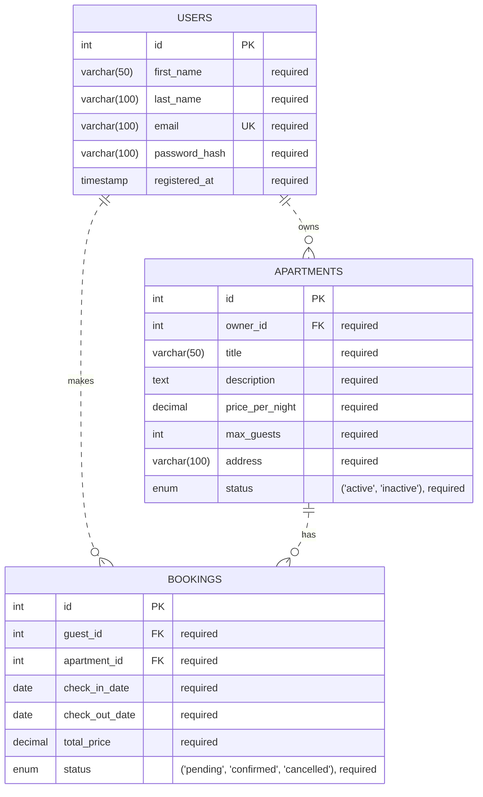

```mermaid
erDiagram
    USERS {
        int id PK
        varchar(50) first_name "required"
        varchar(100) last_name "required"
        varchar(100) email UK "required"
        varchar(100) password_hash "required"
        timestamp registered_at "required"
    }
    APARTMENTS {
        int id PK
        int owner_id FK "required"
        varchar(50) title "required"
        text description "required"
        decimal price_per_night "required"
        int max_guests "required"
        varchar(100) address "required"
        enum status
        "('active', 'inactive'), required"
    }
    BOOKINGS {
        int id PK
        int guest_id FK "required"
        int apartment_id FK "required"
        date check_in_date "required"
        date check_out_date "required"
        decimal total_price "required"
        enum status
        "('pending', 'confirmed', 'cancelled'), required"
    }

    USERS ||..o{ BOOKINGS : makes
    USERS ||..o{ APARTMENTS : owns
    APARTMENTS ||..o{ BOOKINGS : has
```