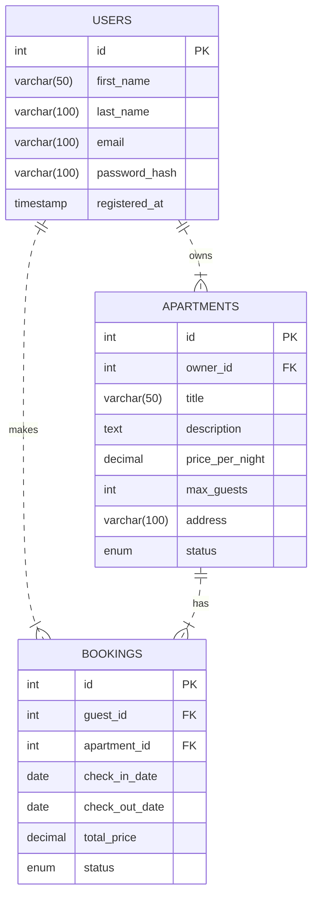

```mermaid
erDiagram
    USERS {
        int id PK
        varchar(50) first_name
        varchar(100) last_name
        varchar(100) email
        varchar(100) password_hash
        timestamp registered_at
    }
    APARTMENTS {
        int id PK
        int owner_id FK
        varchar(50) title
        text description
        decimal price_per_night
        int max_guests
        varchar(100) address
        enum status
    }
    BOOKINGS {
        int id PK
        int guest_id FK
        int apartment_id FK
        date check_in_date
        date check_out_date
        decimal total_price
        enum status
    }

    USERS ||..|{ BOOKINGS : makes
    USERS ||..|{ APARTMENTS : owns
    APARTMENTS ||..|{ BOOKINGS : has
```