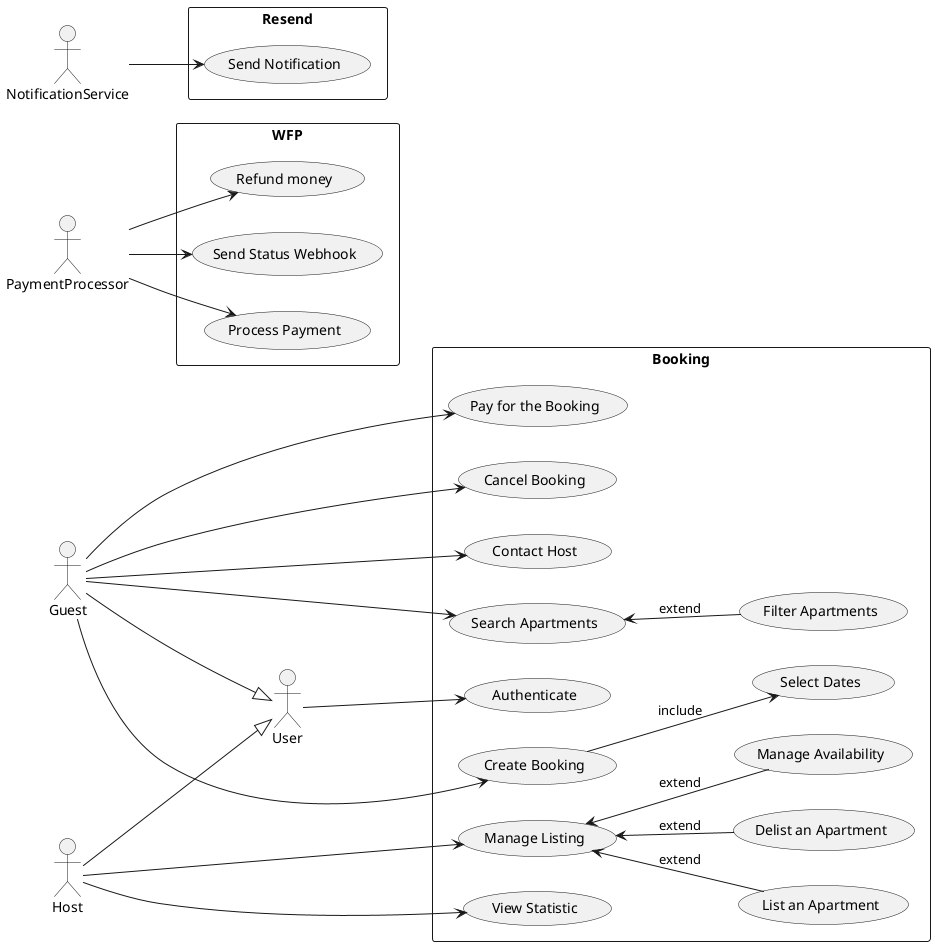

```plantuml
@startuml
left to right direction

actor User
actor Guest
actor Host
actor PaymentProcessor
Actor NotificationService

Guest --|> User
Host --|> User


rectangle Booking {
    usecase "Authenticate"
    usecase "Search Apartments"
    usecase "Filter Apartments"
    usecase "Create Booking"
    usecase "Select Dates"
    usecase "Pay for the Booking"
    usecase "Cancel Booking"
    usecase "Contact Host"

    usecase "Manage Listing"
    usecase "List an Apartment"
    usecase "Delist an Apartment"
    usecase "Manage Availability"
    usecase "View Statistic"

}

rectangle WFP {
    usecase "Process Payment"
    usecase "Refund money"
    usecase "Send Status Webhook"
}

rectangle Resend {
    usecase "Send Notification"
}


User --> "Authenticate"


Guest --> "Search Apartments"
Guest --> "Create Booking"
Guest --> "Pay for the Booking"
Guest --> "Cancel Booking"
Guest --> "Contact Host"

"Search Apartments" <-- "Filter Apartments" : extend
"Create Booking" --> "Select Dates" : include


Host --> "Manage Listing"
Host --> "View Statistic"

"Manage Listing" <-- "List an Apartment" : extend
"Manage Listing" <-- "Delist an Apartment" : extend
"Manage Listing" <-- "Manage Availability" : extend


PaymentProcessor --> "Process Payment"
PaymentProcessor --> "Refund money"
PaymentProcessor --> "Send Status Webhook"


NotificationService --> "Send Notification"
@enduml
```
