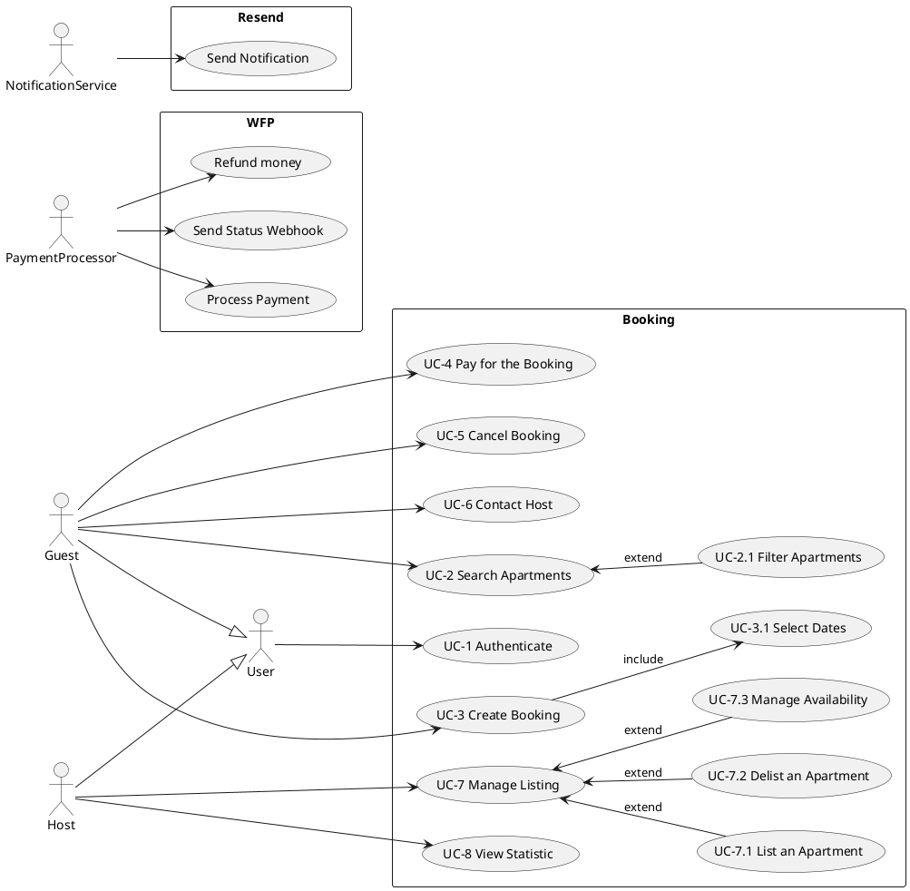

```plantuml
@startuml
left to right direction

actor User
actor Guest
actor Host
actor PaymentProcessor
Actor NotificationService

Guest --|> User
Host --|> User


rectangle Booking {
    usecase "UC-1 Authenticate"
    usecase "UC-2 Search Apartments"
    usecase "UC-2.1 Filter Apartments"
    usecase "UC-3 Create Booking"
    usecase "UC-3.1 Select Dates"
    usecase "UC-4 Pay for the Booking"
    usecase "UC-5 Cancel Booking"
    usecase "UC-6 Contact Host"

    usecase "UC-7 Manage Listing"
    usecase "UC-7.1 List an Apartment"
    usecase "UC-7.2 Delist an Apartment"
    usecase "UC-7.3 Manage Availability"
    usecase "UC-8 View Statistic"

}

rectangle WFP {
    usecase "Process Payment"
    usecase "Refund money"
    usecase "Send Status Webhook"
}

rectangle Resend {
    usecase "Send Notification"
}


User --> "UC-1 Authenticate"


Guest --> "UC-2 Search Apartments"
Guest --> "UC-3 Create Booking"
Guest --> "UC-4 Pay for the Booking"
Guest --> "UC-5 Cancel Booking"
Guest --> "UC-6 Contact Host"

"UC-2 Search Apartments" <-- "UC-2.1 Filter Apartments" : extend
"UC-3 Create Booking" --> "UC-3.1 Select Dates" : include


Host --> "UC-7 Manage Listing"
Host --> "UC-8 View Statistic"

"UC-7 Manage Listing" <-- "UC-7.1 List an Apartment" : extend
"UC-7 Manage Listing" <-- "UC-7.2 Delist an Apartment" : extend
"UC-7 Manage Listing" <-- "UC-7.3 Manage Availability" : extend


PaymentProcessor --> "Process Payment"
PaymentProcessor --> "Refund money"
PaymentProcessor --> "Send Status Webhook"


NotificationService --> "Send Notification"
@enduml
```
