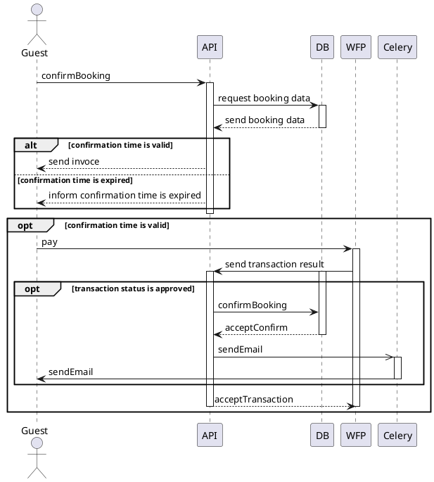

Підтвердження бронювання протягом 3 годин

```plantuml
@startuml

actor Guest as guest

guest -> API : confirmBooking

activate API
API -> DB : request booking data
activate DB
DB --> API : send booking data
deactivate DB

alt confirmation time is valid
API --> guest : send invoce
else confirmation time is expired
API --> guest : inform confirmation time is expired
end
deactivate API

opt confirmation time is valid
guest -> WFP : pay
activate WFP
WFP -> API : send transaction result
activate API
opt transaction status is approved
activate DB
API -> DB : confirmBooking
DB --> API : acceptConfirm
deactivate DB
API ->> Celery : sendEmail
activate Celery
Celery -> guest : sendEmail
deactivate Celery
end
API --> WFP : acceptTransaction
deactivate WFP
deactivate API
end

@enduml
```