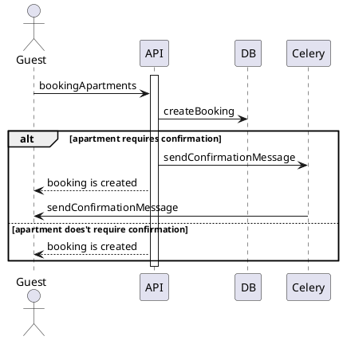

Запит на бронювання вільних апартаментів

```plantuml
@startuml

actor Guest as guest
activate API


guest -> API : bookingApartments
API -> DB : createBooking

alt apartment requires confirmation
API -> Celery : sendConfirmationMessage
API --> guest : booking is created
Celery -> guest : sendConfirmationMessage
else apartment does't require confirmation
API --> guest : booking is created

end
deactivate API
@enduml
```