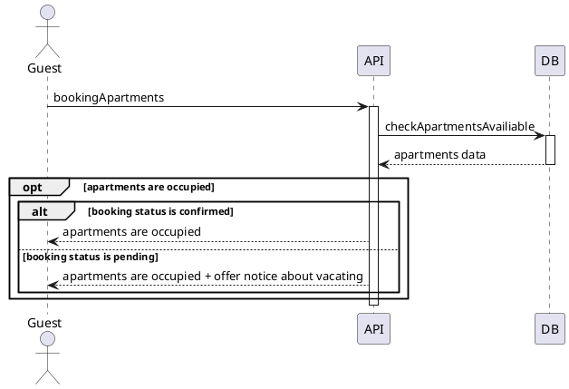

Запит на бронювання зайнятих апартаментів

```plantuml
@startuml

actor Guest as guest

guest -> API : bookingApartments
activate API

API -> DB : checkApartmentsAvailiable
activate DB 
DB --> API : apartments data
deactivate DB 

opt apartments are occupied
alt booking status is confirmed
API --> guest : apartments are occupied
else booking status is pending
API --> guest : apartments are occupied + offer notice about vacating
end
end
deactivate API


@enduml
```